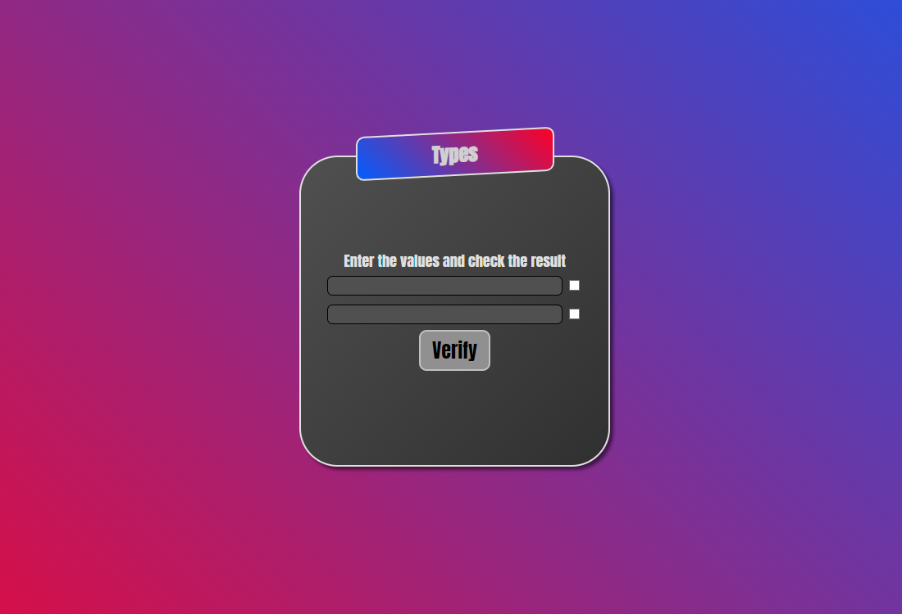

<h1 align="center">

  
   
   
  Day 1 Project / Verify Type of Inputs
</h1>

This program checks two inputs! ee returns the result (if they are exactly the same, or the same with different types, or different)

  

  

## How Use

This program is used to learn the differences between the types of variables.
check the input on the right if the input on the left is a number, then click the button to check.

## License

This project is licensed under the MIT License - see the [LICENSE](https://opensource.org/licenses/MIT) page for details.
